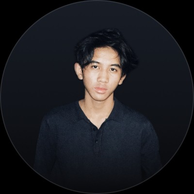
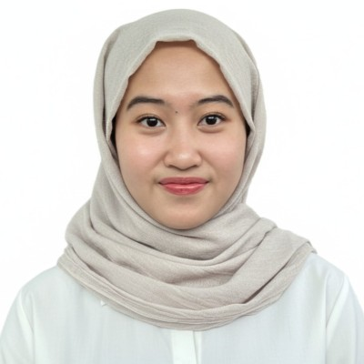

# 🌾 NAMA TEAM (BLOM ADA WKWK! SAMA DI FOOTER JG HRS DI GANTI NAMA TEAMNYA)
### Hackathon SIMKopDes · Pilar 2: Keterlibatan Masyarakat dalam Berkoperasi

*Orkestrator Keanggotaan Digital & Hilirisasi Komoditas untuk Koperasi Desa*

---

## 👥 Anggota Tim

---

### 1. 🧑‍💻 Filbert Christian Winch

  
    
  
  
  <!--  -->

 

| Info | Detail |
|------|--------|
| **Role** | Full-Stack Engineer / ML Engineer/ DevOps Engineer|
| **Skills** |**Languages**: Go, TypeScript, Java, Python, C++ / **Frameworks**: React.js, tanstack, svelte,  Nest.js, FastAPI, Spring Boot / **Infrastructure & Data**: Docker, gRPC, PostgreSQL, Redis, VPS Deployment **IoT & AI**: Sensor Fusion (pH, Temperature), Real-Time Monitoring, Predictive Modeling |
| **Experience** |Full-Stack Software Engineer at MidHub, Full-Time Information Systems Laboratory Assistant, BINUS University|

#### 🚀 Highlighted Projects
- 🏆 **[Project Lomba / Hackathon] BioSerDe**  — **Smart Portable Biogas Digester**
Sebuah platform energi bersih berbasis IoT dan AI yang mengubah limbah organik menjadi biogas. Merancang arsitektur *pipeline* penyerapan data *real-time* untuk telemetri tertanam (sensor pH dan suhu), serta mengintegrasikan model AI prediktif untuk memantau, menganalisis, dan mengoptimalkan efisiensi produksi metana secara dinamis.
- 💼 **[Enterprise Project] MidHub.id  — Heavy Equipment Marketplace**
Berperan sebagai *Full-Stack Software Engineer* untuk platform *marketplace* alat berat terkemuka di Indonesia (https://midhub.id/). Merancang dan mengoptimalkan arsitektur *backend* inti dengan skalabilitas tinggi, memastikan pengambilan data dengan latensi rendah dan *pipeline* transaksi yang andal untuk operasi skala *enterprise*.
- 🎓 **[Project Akademik / Capstone]** — 
**BekenSpot**: Mengembangkan platform reservasi ruangan dan ruang kerja (*workspace*) *all-in-one*, serta membangun mesin ketersediaan yang dioptimalkan untuk menangani permintaan pemesanan secara bersamaan tanpa *race condition* di BINUS @Bekasi. 
**Minat-Apps**: Mengembangkan software tes assessment psikometrik dengan *throughput* tinggi yang memproses masukan pengguna untuk memodelkan sifat kepribadian dan menghasilkan rekomendasi jalur karier otomatis berbasis data, yang dikhususkan untuk siswa SMA tingkat akhir.
---

### 2. 🧑‍💻 Abdul Aziz Zaki Hidayat

  
    
  
  
  

 

| Info | Detail |
|------|--------|
| **Role** | Frontend Developer / UI Engineer |
| **Skills** | **Web Dev** : HTML, CSS, PHP / **Mobile Dev** : Dart, Flutter / **UI/UX Design** : Figma, Design System, Wireframing, Mobile & Web Design, Prototyping, Component, Variant, Design Thinking, Problem Solving  |
| **Experience** | Momentree – UI/UX Design Internship |

#### 🚀 Highlighted Projects
- 🌿 **Smart Sawit — IoT Watering System** — Sistem otomasi penyiraman tanaman sawit berbasis sensor soil moisture, ESP32. Real-time monitoring via Blynk dashboard.

- 🏠 **Home Automation Platform** — Integrasi multi-protokol (Zigbee, Tuya, Threads) menggunakan Home Assistant + Docker. Mendukung 50+ device dengan otomasi berbasis YAML.

- 🏆 **Project Lomba** — Folklora: A gamified detective app to help young learners in discovering Indonesian folklore through interactive cases | 3rd Place, International UI/UX Design Competition Vocational Worldwide Olympiad UI | https://s.id/peD7i

- 💻 **BekenQuest — Gamification Scoring Platform** — Merancang dan mengembangkan aplikasi web interaktif untuk Binus University's Freshmen Year Program. Sistem ini mendigitalisasi proses penilaian manual menjadi platform live-scoring yang dinamis dengan fitur digital collectibles dan integrasi ekspor media sosial berbasis DOM-to-image.

---

### 3. 👩‍💻 Nadine Syifa Swasana

  
    
  
  
  <!--  -->
  

 

| Info | Detail |
|------|--------|
| **Role** | UI/UX Designer / Product Manager |
| **Skills** | Figma · Prototyping · User Research · Design Thinking · Project Management |
| **Experience** | Information Systems Laboratory Assistant for Database Fundamental, BINUS University
 |

#### 🚀 Highlighted Projects
- 🎨 **UI/UX Design Project** — LabSaku: Interactive Virtual Science Lab at Your Fingertips Designed for Indonesian High School Students | https://bit.ly/prototype-labsaku

- 🏆 **Project Lomba** — Folklora: A gamified detective app to help young learners in discovering Indonesian folklore through interactive cases | 3rd Place, International UI/UX Design Competition Vocational Worldwide Olympiad UI | https://s.id/peD7i

- 📱 **Product Design / Prototype** — GarudaFit: Cetak Talenta Muda Indonesia Berkualitas Global – Inovasi Pelatihan Olahraga Berbasis AI & Komunitas Menuju Kemandirian Bangsa dan Visi Indonesia Emas 2045 | Grand Final, GEMASTIK XVIII 2025 | https://bit.ly/garudafit-proto

---

## 🌾 Deskripsi Ide: KORPUS

### **KORPUS**
#### *Orkestrator Keanggotaan Digital & Hilirisasi Komoditas*
##### Memberdayakan Koperasi Desa Menuju Kedaulatan Ekonomi Inklusif, Ketahanan Pangan Nasional, dan Visi Indonesia Emas 2045

---

### 📌 Problem Statement

Koperasi Desa (Kopdes) merupakan urat nadi Program Strategis Nasional dengan **83.000 unit berbadan hukum**. Tragisnya, dari **270 juta penduduk desa**, partisipasi tertahan di angka **2 juta anggota**. Rendahnya penetrasi ini mengancam visi kedaulatan ekonomi bangsa.

Akar masalahnya bersifat struktural:

1. 🚫 **Absennya infrastruktur onboarding digital** yang inklusif bagi masyarakat grassroot dengan literasi rendah
2. 🔒 **Defisit kepercayaan** akibat tata kelola bagi-hasil yang buram dan tidak transparan
3. 🔗 **Putusnya rantai penghubung** antara keringat petani dengan ekosistem hilirisasi komoditas bernilai tambah

> *Tanpa intervensi teknologi yang membumi, potensi raksasa Kopdes sebagai garda terdepan ketahanan pangan akan terus tertidur. Partisipasi masif tidak bisa dipaksa, melainkan harus dibangun melalui sistem yang merombak birokrasi menjadi transparan, ramah pengguna, dan menjamin peningkatan kesejahteraan nyata bagi masyarakat desa.*

---

### 💡 Deskripsi Solusi

**KORPUS** adalah platform digital *end-to-end* yang dirancang dengan pendekatan *user-centric* untuk membangkitkan kekuatan ekonomi di 83.000 desa, menyelaraskan mandat hilirisasi komoditas dan pemberdayakan petani secara berkelanjutan.

Inovasi KORPUS digerakkan oleh **tiga pilar teknologi strategis**:

#### 1. 🟢 Inklusi Digital Tanpa Hambatan *(Frictionless Onboarding)*
Desain antarmuka berbasis visual yang ramah grassroot — keanggotaan teraktivasi **instan via integrasi NIK Dukcapil dan OTP WhatsApp**, tanpa email atau proses klerikal yang rumit. Setiap petani dibekali **Identitas Koperasi Digital (QR Code)** untuk akses instan ke seluruh layanan.

#### 2. 💳 Ekosistem Transaksi Terpusat *(Celengan & POS)*
Mobile wallet intuitif yang memberdayakan petani untuk transaksi, menabung, dan menerima aliran dana hilirisasi secara *real-time*. Di sisi manajerial, pengurus Kopdes dipersenjatai sistem **Point of Sales (POS)** modern untuk digitalisasi inventaris dan pelaporan otomatis — memangkas birokrasi dan mendongkrak akuntabilitas tingkat desa.

#### 3. 📊 Tracker Komoditas & Logic Smart Contract
Petani dapat memantau metamorfosis panen mentah menjadi produk hilir bernilai tinggi secara presisi. **Distribusi SHU dikalkulasi otomatis** lewat algoritma terenkripsi yang dikunci saat Rapat Anggota Tahunan, mustahil dimanipulasi secara sepihak — mengadopsi keamanan ala *smart contract*, namun dirancang ringan agar beroperasi optimal pada **jaringan 3G di pelosok**.

---

### 🎯 Target Dampak

| Indikator | Kondisi Saat Ini | Target KORPUS |
|-----------|-----------------|---------------|
| Partisipasi anggota Kopdes | ~2 juta dari 270 juta | **≥30% populasi desa** |
| Kopdes aktif secara digital | Minimal | **83.000 Kopdes** terdigitalisasi |
| Transparansi distribusi SHU | Manual / rentan manipulasi | **Otomatis & terenkripsi** |
| Onboarding anggota baru | Klerikal, butuh literasi tinggi | **Instan via NIK + OTP WA** |

---

### 🏆 Visi Akhir

> *Mendongkrak partisipasi masyarakat grassroot hingga menyentuh minimal **30% dari total penduduk desa secara nasional**, mengonversi **83.000 Kopdes** menjadi mesin penggerak ekonomi raksasa yang aktif. Melalui KORPUS, kita tidak sekadar mengejar angka keanggotaan, melainkan memastikan jutaan petani beralih menjadi **aktor utama** dalam panggung ketahanan pangan, memperkokoh kemandirian bangsa, dan mempercepat terwujudnya **Visi Indonesia Emas 2045**.*

---

*KORPUS · Hackathon SIMKopDes 2026 · Tim KORPUS*

